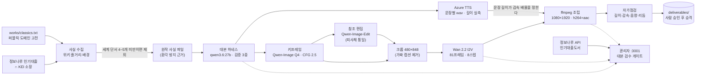

# Bard · 로컬 GPU 문학 쇼츠 생산 라인


문학 작품의 **세계**를 30~45초 한국어 내레이션 세로 영상으로 만드는 온프레미스 파이프라인.
대본·이미지·영상·음성·조립이 전부 이 서버 안에서 돌고, 외부로 나가는 것은 TTS 합성 요청뿐이다.
GPU는 **Quadro RTX 6000 24GB ×2 (Turing, sm_75)** — 이 하드웨어의 제약이 설계 전반을 결정했다.

> **핵심 원칙: 책 '에 대한' 이야기가 아니라 책 '속' 세계를 그린다.**
> 출판사·수상 이력·대출 통계를 낭독하기 시작하면 영상은 도서관 안내가 된다. 실제로 그렇게 무너진
> 적이 있고(v0.9), 그 뒤로 메타 어휘를 기계가 잡아낸다.

**두 라인** — 퍼블릭 도메인 **고전은 각색형**(위키백과 줄거리·배경으로 세계를 재구성),
저작권이 살아 있는 **현대서는 소개형**(줄거리를 옮기지 않고 배경과 공기만). 어느 쪽이든
세계를 그릴 재료(`world_material`)가 기준 미만이면 제작하지 않는다.

> [!IMPORTANT]
> 권위 순서는 **[`docs/SPEC.md`](./docs/SPEC.md)(v1 합격 기준) → [`docs/PLAN.md`](./docs/PLAN.md)(로드맵·의사결정) → [`docs/NARRATIVE.md`](./docs/NARRATIVE.md)(서사 규칙의 근거) → [`docs/PIPELINE.md`](./docs/PIPELINE.md)(실행 절차)** 이다.
> 릴리스 단위 변경은 [`CHANGELOG.md`](./CHANGELOG.md).
> 이 README는 **지도**일 뿐 진실원천이 아니다. 세션 인수인계는 [`HANDOFF.md`](./HANDOFF.md).

**바로 가기** — 운영자: [지금 상태](#지금-상태) · [문제가 생겼을 때](#문제가-생겼을-때--실제로-겪은-것들) · [무엇이 되고 무엇이 안 되나](#무엇이-되고-무엇이-안-되나) / 개발자·에이전트: [시작하기](#시작하기) · [검증 게이트](#검증-게이트) · [문서 지도](#문서-지도)

---

## 지금 상태

**전부 이 서버에서 실측(2026-08-13).** 값이 아니라 **확인 명령이 계약**이다 — 의심되면 직접 돌린다.

| 항목 | 값 | 확인 |
| --- | --- | --- |
| GPU | Quadro RTX 6000 24GB **×2** · sm_75 | `venv/bin/python -c "import torch;print(torch.cuda.device_count())"` |
| fp16 텐서코어 실측 | **약 90 TFLOPS** (이론 피크의 ~70%) | 워밍업 후 8192² matmul 30회 |
| ComfyUI | **:8188** · systemd `comfyui.service` | `curl -s localhost:8188/queue` |
| Ollama | **:11434** · `qwen3.6:27b` (Q4_K_M 17GB) | `ollama list \| grep qwen` |
| 관리자 API | **:8010** (FastAPI, `0.0.0.0` 바인딩) | `curl -s localhost:8010/api/health` |
| 관리자 UI | **:3001** (Next.js 15, Node 20) | `curl -s -o /dev/null -w '%{http_code}' localhost:3001` |
| 키프레임 1장 | **약 5분** (Qwen-Image Q4, 720×1280, 20스텝, CFG 2.5) | `logs/kf_*.log` 의 `완료 NNNs` |
| 참조 편집 1장 | **약 15분** (Qwen-Image-Edit-2509) | `logs/s6edit*.log` |
| I2V 1클립 | **약 7.3분** (Wan 2.2, 480×848, 81프레임, 8스텝) | `logs/i2v_*.log` |
| 한국어 TTS 속도 | **6.67자/초** (rate 0%) — 30자 ≈ 4.5초 | `ffprobe -show_entries format=duration output/tts/*.wav` |
| 완성본 1편 | **GPU 약 1.5~2시간** (8장면, 교정 반복 포함) | 아래 단계별 합산 |
| 도서 API | 정보나루 **승인 완료** · 7월 인기대출 5,000건 | `curl -s "localhost:8010/api/books/popular?limit=5"` |
| 완성본 | 수동 3편(모비딕·카프카·톨스토이) + **야간 자동 6편** | `ls output/*/final_night.mp4` |
| 명세 대조 | `tests/test_spec.py` 58항목 통과 | `venv/bin/python tests/test_spec.py` |

> [!IMPORTANT] Turing이 만든 임계선 — 이 프로젝트의 가장 비싼 교훈
> sm_75에는 **FlashAttention이 없다.** latent이 커지면 ComfyUI가 추론용 VRAM을 선점해
> 12GB 모델이 **부분 로드**(2.5GB 상주 / 9GB CPU 오프로드)되고 스텝당 400초대로 무너진다.
>
> | 해상도·길이 | usable VRAM | 로드 | 클립당 |
> | --- | --- | --- | --- |
> | 480×832 · 121프레임 | 15,504 MB | 완전 | **6분 17초** |
> | 720×1280 · 121프레임 | 2,791 MB | **부분(9GB 오프로드)** | **29분 11초** |
>
> **디바이스 배치로는 해결되지 않는다** — 인코더 이동·unet 카드 분산 3종을 시도했으나
> `usable`은 2.8GB에서 미동도 하지 않았다. 해상도를 낮춰 완전 로드를 유지하는 것이 유일한 해법이다.
> 121프레임은 첫 프레임 손상이 보고돼 있어 **81프레임**을 쓴다.
> SageAttention·torch.compile·fp8 체크포인트는 sm_75에서 동작하지 않으므로 **시도하지 말 것**.

---

## 문제가 생겼을 때 — 실제로 겪은 것들

전부 이 프로젝트에서 실제로 발생했고 원인이 규명된 건들이다. 전체 표는 [`docs/PIPELINE.md`](./docs/PIPELINE.md) §실패 사례.

| 증상 | 30초 확인 | 다음 |
| --- | --- | --- |
| **영상이 갑자기 4배 느려짐** | `grep "loaded partially" logs/comfyui.log \| tail -1` | 부분 로드다. 해상도를 480×848로 되돌린다 → 위 임계선 표 |
| **스타일 지시가 무시됨**(판화 요청 → 광택 디지털아트) | 증류 LoRA를 쓰는가? CFG가 1인가? | **CFG=1에서는 네거티브가 계산조차 되지 않는다.** T2V로 스타일을 통제할 수 없다 → 키프레임(CFG 2.5)에서 확정하고 I2V는 모션만 |
| **같은 대상이 장면마다 다르게 나옴**(향유고래 → 흰수염고래) | 키프레임을 각각 독립 생성했는가? | Qwen-Image-Edit에 승인된 이미지를 **단독 참조**로. `--scene`을 같이 주면 장면 쪽 피사체가 이긴다(2회 실측) |
| **피사체가 기하학 도형처럼 나옴**(고래가 지우개) | 프롬프트에 `blocky rectangular` 같은 도형 용어가 있는가? | 이미지 모델은 문자 그대로 그린다. **해부학 묘사**로 바꾼다("둥근 이마 → 유선형 몸통") |
| **대본이 문법은 맞는데 지루함** | `narrative_issues()` 를 통과했는가? | 문체 검증만으로는 못 잡는다. 서사 검증층(훅·인과·반전·리듬·열린 결말) → [`docs/NARRATIVE.md`](./docs/NARRATIVE.md) |
| **TTS 합성이 깨짐** | 문장에 `<제목>` 같은 꺾쇠가 있는가? | SSML은 XML이라 태그로 해석된다. 파서에서 원천 제거 중 |
| **`git add -A` 가 멈춤** | `du -sh models/` | 63GB를 해싱한다. `models/`는 `.gitignore`에 있고 **명시 경로만 add** |
| **백그라운드 프로세스가 시작하자마자 죽음** | 같은 셸 블록에 `pkill -f "패턴"` 이 있는가? | `pkill -f`는 **자기 자신의 명령줄을 매칭**한다. kill과 start를 다른 호출로 분리한다 |
| **관리자 페이지 Failed to fetch** | 브라우저 주소가 `127.0.0.1`인가 서버 IP인가 | 프론트가 접속 호스트에서 API 주소를 유추한다. 백엔드가 `0.0.0.0`에 바인딩됐는지 확인 |

---

## 무엇이 되고 무엇이 안 되나

| 영역 | 상태 | 근거 |
| --- | --- | --- |
| 대본 생성 + 검증 하네스 | ✅ | `scripts/write_script.py` — 문체 5종 + 서사 10종 |
| 키프레임 스타일 고정 | ✅ | 스타일 블록을 프롬프트 **맨 앞에 바이트 동일**하게 |
| 피사체 일관성 | ✅ | 참조 편집(단독 참조) |
| I2V 영상화 + 문장 동기화 | ✅ | 문장별 TTS 실측 길이 → 클립 감속 배율 |
| 한국어 내레이션 | ✅ | Azure Speech F0 무료 티어 (월 50만 자 ≈ 2,800편) |
| 관리자 콘솔(대본 검수·키프레임·완성본) | ✅ | Next.js :3001 + FastAPI :8010 |
| 인기대출도서 조회 | ✅ | 정보나루 API 승인 완료 |
| **KEI 도서관 소장 확인** | ❌ | 목록이 JS 렌더링 · **공개 API 없음**. Playwright 헤드리스 필요 |
| **자막·효과음·BGM** | ❌ | 미착수 |
| **업로드 자동화** | ❌ | 미착수 (YouTube Data API) |
| **8문장 자동 생성** | ⚠️ | 제약 12개를 동시 만족시키지 못해 표류. 현재는 **사람이 저작하고 하네스가 검증** |

---

## 데이터 흐름



**내레이션이 시계다.** 문장별 TTS 실측 길이에 맞춰 각 클립을 감속하므로 장면 전환이 문장 시작과 정확히 일치한다.
대본이 바뀌어도 **영상 재생성 없이 재조립**된다.

**사실은 세 겹으로 막는다.** 자료에 없는 수치는 정규식(`fact_issues`), 지어낸 고유명사는 모델 대조
(`source_issues`), 동음이의 문서 오염은 저자명 확인으로 잡는다. 수리에 실패하면 조용히 넘기지 않고
`재작성 실패 — 아침 검수 대상`을 로그에 남긴다.

---

## 하지 않는 것 (Non-goals)

의도적으로 **안 하는** 선택이다. 반대 방향 변경은 근거를 먼저 뒤집어야 한다.

1. **T2V로 스타일을 통제하지 않는다.** 증류 LoRA의 CFG=1에서 네거티브는 계산되지 않는다. 스타일은 이미지 단계에서 확정한다.
2. **720p 이상으로 생성하지 않는다.** Turing에서 부분 로드로 붕괴한다. 업스케일은 ffmpeg가 한다.
3. **현대 저작물을 각색하지 않는다.** 퍼블릭 도메인 고전만 다룬다 — 2차적 저작물 침해와 유튜브 "본인이 만들지 않은 자료의 낭독" 수익화 제한을 동시에 피한다.
4. **검증 규칙을 UI에 재구현하지 않는다.** 관리자 페이지의 재검증은 서버가 `write_script.py`의 검증기를 그대로 재실행한다. 규칙이 두 곳에 있으면 반드시 어긋난다.
5. **60초를 넘기지 않는다.** 저작권 클레임 시 수익 분배가 아니라 **전 세계 차단**이다.
6. **기계 검증을 사람 검수의 대체로 쓰지 않는다.** 의미 왜곡("아버지가 던진 사과" → "남기신 사과")은 코드가 못 잡는다.

---

## 시작하기

```bash
python3 -m venv venv && source venv/bin/activate
pip install "huggingface_hub[cli]" fastapi "uvicorn[standard]"
pip install --index-url https://download.pytorch.org/whl/cu128 torch torchvision torchaudio
git clone https://github.com/comfyanonymous/ComfyUI   # + ComfyUI-GGUF, ComfyUI-MultiGPU
bash scripts/download_models.sh                        # Wan 2.2 세트 (~63GB)
cp .env.example .env                                   # Azure Speech · 정보나루 키 입력
```

> [!CAUTION] 긴 GPU 작업은 반드시 분리해서 띄운다
> 셸 도구의 타임아웃(2분)에 걸리면 폴링 클라이언트만 죽고 ComfyUI 작업은 서버에서 계속 돈다 — 상태를 놓친다.
> ```bash
> setsid nohup venv/bin/python scripts/gen_i2v.py ... > logs/x.log 2>&1 < /dev/null & disown
> ```
> 그리고 **완료 판정은 종료코드가 아니라 산출 파일 + ffprobe 스트림 확인으로 한다.**
> 이 프로젝트에서 exit 0인데 실패한 사례가 2회 있었다(ollama pull 네트워크 실패, 쓰는 중인 mp4를 읽어 `moov atom not found`).

### 서비스 기동

```bash
sudo systemctl start comfyui                                    # :8188
setsid nohup venv/bin/uvicorn backend.main:app \
  --host 0.0.0.0 --port 8010 > logs/api.log 2>&1 < /dev/null &   # 관리자 API
cd admin && npm run dev                                         # :3001
```

### 작품 고르고 재료 모으기

```bash
# 퍼블릭 도메인 고전 — 위키 줄거리·배경을 받아 각색형으로 큐에 넣는다
venv/bin/python scripts/refill_queue.py --classics --max-add 4 --dry-run

# 현대 인기대출도서 — KEI 소장본만, 세계 단서 5개 이상만
venv/bin/python scripts/refill_queue.py --limit 40 --max-add 4 --dry-run

# 한 권만 확인
venv/bin/python scripts/fetch_book_facts.py --title 날개 --author 이상 --format narrative
venv/bin/python scripts/kei_holdings.py --title 모비딕 --author 멜빌
```

### 한 편 만들기

```bash
# ① 대본 (하네스가 검증하고 불합격 문장만 재작성)
venv/bin/python scripts/write_script.py --title 모비딕 --facts facts/mobydick.txt \
  --scenes 8 --minlen 29 --maxlen 40 --tone 서늘 --emphasis \
  --persons "에이해브,퀴퀘그,이슈메일" \
  --ending "소설 모비딕에서 만날 수 있습니다" --out output/mobydick/narration_v4.json

# ①-2 톤·텐션 곡선을 실은 음성 (담담/따뜻/서늘/긴장/속삭임/생동)
venv/bin/python scripts/tts_render.py --narration output/mobydick/narration_v4.json \
  --tone 서늘 --arc 산형 --prefix output/tts/mobydick_v4_s

# ② 키프레임 (스타일 블록을 모든 장면에 바이트 동일하게)
venv/bin/python scripts/gen_keyframe.py --seed 202 --prefix "mobydick_kf/v4_s1" \
  --prompt "<스타일 블록> + <장면 묘사>" --negative "photorealistic, ..., caption, letters"

# ③ I2V (스타일은 이미지가 결정 — 프롬프트에는 모션·카메라만)
venv/bin/python scripts/gen_i2v.py --image kf1.png --prefix "mobydick_i2v/s1" \
  --length 81 --seed 42 --prompt "mist drifts across the deck, slow dolly in"

# ④ 자가점검 (길이·감속·음량·리듬·대본) — 음량이 벗어나면 --fix-loudness 로 교정
venv/bin/python scripts/review_output.py --work mobydick --fix-loudness
```

### 밤새 돌리기

```bash
sudo systemctl start aivideo-night.service      # 20:00 자동 기동, 08:00 착수 중단, 09:40 마무리
START_BY=1930 FINISH_BY=1930 ./scripts/night_batch_v2.sh   # 개발 중 수동 실행
tail -f logs/night/$(TZ=Asia/Seoul date +%F).log
```

절차 전체와 파라미터 근거는 [`docs/PIPELINE.md`](./docs/PIPELINE.md).

### 검증 게이트

```bash
venv/bin/python tests/test_spec.py          # 명세 대조 (docs/SPEC.md 의 값과 구현이 같은지)
curl -s localhost:8010/api/health           # API
cd admin && npx tsc --noEmit                # 프론트 타입
```

`tests/test_spec.py` 는 GPU·외부 API 없이 수초 안에 끝난다. 대본 규격·사실 검증 3중·영상 규격·
톤·제작 대상 판정·야간 시간 정책·큐 형식·구문을 전부 대조하며, **명세와 구현이 어긋나면 여기서 걸린다.**

> [!NOTE] `git add -A`를 쓰지 않는다
> `models/`에 63GB가 있어 해싱에서 멈춘다. `.gitignore`에 들어 있지만 **명시 경로만 add**하는 습관이 안전하다.

---

## 문서 지도

| 무엇 | 어디 |
| --- | --- |
| 로드맵 · 45초 스펙 · 도서 시리즈 설계 · 관리자 페이지 범위 | [docs/PLAN.md](./docs/PLAN.md) |
| 서사 규칙의 **근거** — 왜 줄거리 요약이 죽는가 | [docs/NARRATIVE.md](./docs/NARRATIVE.md) |
| 단계별 실행 절차 · 파라미터 · **실패 사례표** | [docs/PIPELINE.md](./docs/PIPELINE.md) |
| 세션 인수인계 — 상태·서비스·운영 함정 | [HANDOFF.md](./HANDOFF.md) |
| 완성 영상 목록과 scp 수령 방법 | [VIDEOS.md](./VIDEOS.md) |
| 정보나루 API 매뉴얼 | [docs/reference/](./docs/reference) |
| 하드웨어 벤치마크 클립과 측정 조건 | [samples/README.md](./samples/README.md) |

### 스크립트

| 파일 | 역할 |
| --- | --- |
| `scripts/write_script.py` | 대본 하네스 — 검증 15종 + 문장별 재수정 루프 |
| `scripts/gen_keyframe.py` | Qwen-Image 키프레임 (ComfyUI API) |
| `scripts/gen_edit.py` | Qwen-Image-Edit 참조 편집 (피사체 통일) |
| `scripts/gen_i2v.py` | Wan 2.2 I2V (81프레임) |
| `scripts/gen_t2v.py` | Wan 2.2 T2V — 벤치마크·보조용 (프로덕션 미사용) |
| `backend/db.py` · `backend/main.py` | SQLite 작업 큐 · 관리자 REST API |
| `admin/` | Next.js 관리자 콘솔 |

---

## 모델과 라이선스

| 모델 | 양자화 | 라이선스 | 용도 |
| --- | --- | --- | --- |
| Wan 2.2 A14B (T2V/I2V) | GGUF Q6_K | **Apache 2.0** | 영상 생성 |
| Wan2.2-Lightning LoRA | — | Apache 2.0 | 4~8스텝 증류 |
| Qwen-Image | GGUF Q4_K_M | Apache 2.0 | 키프레임 |
| Qwen-Image-Edit-2509 | GGUF Q4_K_M | Apache 2.0 | 참조 편집 |
| Qwen3.6-27B | GGUF Q4_K_M (Ollama) | Apache 2.0 | 대본 |
| Azure Speech ko-KR Neural | 클라우드 | F0 무료 티어 | 내레이션 |

전부 상업적 이용이 가능한 조합이다. **VAE 주의** — A14B는 Wan **2.1**의 16채널 VAE를 쓴다.
48채널 `wan2.2_vae`는 TI2V-5B 전용이라 물리면 채널 불일치로 죽는다(실측).

---

## 로드맵

| | 내용 | 상태 |
| --- | --- | --- |
| **P0** | 이미지 우선 파이프라인 확립 | ✅ 모비딕 v3.2 · 카프카 v2 완성 |
| **P1** | 서사 검증층 · 공개 문서화 | ✅ `narrative_issues()` · MIT |
| **P2** | 45초 개편 + 구조 A/B | 🔄 대본·TTS·키프레임 완료, I2V 남음 |
| **P3** | 관리자 콘솔 | ✅ v1 라이브 (:3001 + :8010) |
| **P4** | 도서 시리즈 — "우리 원에 있는 인기도서" | 🔄 정보나루 승인 완료 · **KEI 소장 확인 미해결** |
| **P5** | 자막 · 효과음 · BGM · 업로드 자동화 | ⬜ |

<details>
<summary><b>알려진 드리프트</b> — 새 작업 전에 확인할 것</summary>

- **8문장 자동 생성이 수렴하지 않는다.** 제약 12개를 동시에 만족시키지 못해 원작과 반대되는 내용("평온한 항구에 도착")이나 없는 인물("스타벅 신부")이 나온다. 현재 v4 대본은 **사람이 저작하고 하네스가 검증**한 것이다. 6문장에서는 수렴했으므로 문장 수가 임계 변수로 보인다.
- **작업 큐에 워커가 없다.** `backend/db.py`에 스키마와 선점 로직이 있으나 소비하는 워커가 미구현이라 큐가 비어 있다. 현재 파이프라인은 셸 스크립트 직접 실행이다.
- **`gen_t2v.py`는 프로덕션에서 쓰지 않는다.** 벤치마크 근거로 남겨둔 것이며, 이미지 우선 전환 이후 실사용 경로가 아니다.
- **톨스토이는 내레이션만 완료**돼 있고 키프레임부터 남아 있다.
- 서버 **아웃바운드가 간헐적으로 불안정**하다 — 파일 업로드 타임아웃, Cloudflare R2(ollama pull) 연결 리셋이 관측됐다. HF 다운로드는 정상.
</details>

---

MIT License. 소재는 퍼블릭 도메인 고전만 사용한다.
